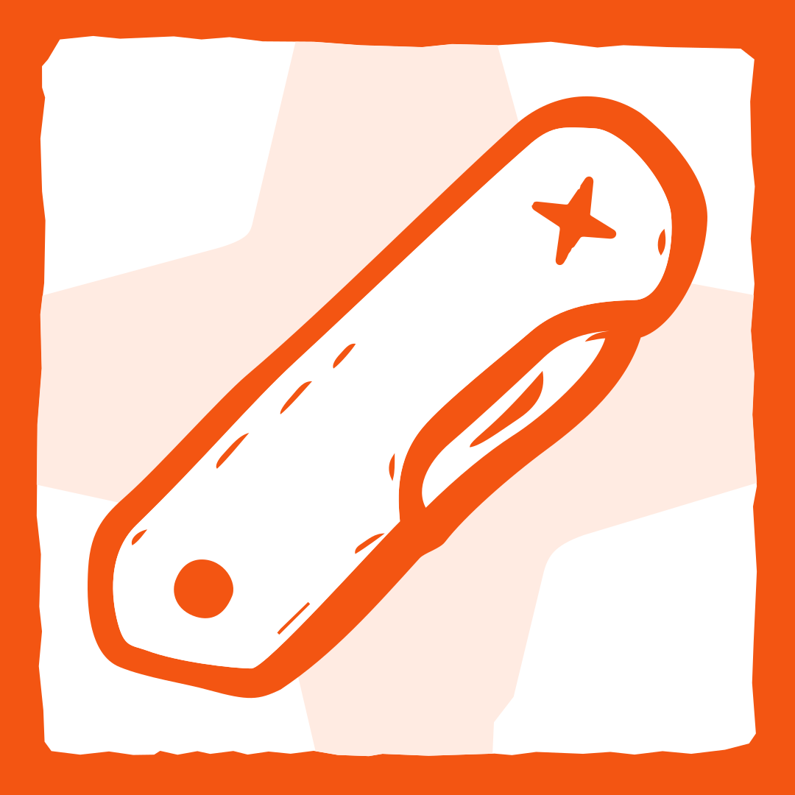

# Design Engineer

🇺🇦  Плагін для Claude Code, заснований на технічних статтях і практичних прикладах з [volomydyr.com](https://volomydyr.com). Це як швейцарський ніж для дизайн-інженерів: ідеація, дослідження, психологія, прототипування та розробка – усе в одному зручному й легкому у використанні інструменті.

Пишете команду `/de:start`, плагін розуміє, на якому ви етапі – чи починаєте з нуля, чи продовжуєте створення продукту, чи хочете скористатися ним для існуючого комерційного проекту. Детальну інструкцію та повний опис можна знайти нижче англійською.

[Звʼязатися з автором (LinkedIn)](https://www.linkedin.com/in/merlenkov/) · [Телеграм спільнота про АІ та Дизайн (1,100+ учасників)](https://t.me/+RzzmoFVG5awzYjIy)

---

A plugin for [Claude Code](https://docs.anthropic.com/en/docs/claude-code) that walks you through building a product, start to finish. Research, design, psychology, code – it covers every phase and teaches you the thinking along the way.

## What you need

Before installing, check that you have these:

1. **Claude Code** – Anthropic's AI coding tool that runs in your terminal. If you don't have it yet, follow the [official install guide](https://docs.anthropic.com/en/docs/claude-code/getting-started). You'll need an Anthropic account with a Max or Team plan, or API credits.

2. **Node.js v18+** – the plugin's safety hooks and status line need it. Check with `node --version`. If missing, grab it from [nodejs.org](https://nodejs.org/) or run `brew install node`.

3. **Python 3** – used for dependency tracking and environment detection. Check with `python3 --version`. Already installed on macOS and most Linux distributions.

4. **Bash** – runs the setup scripts. Built into macOS and Linux. Windows users need WSL.

## Install

Open Claude Code in your terminal and run:

```
/install-plugin https://github.com/volomydyr/design-engineer-plugin
```

That's it. The plugin is available in every Claude Code session from now on.

## Getting started

Start a new Claude Code session in your project directory and type:

```
/de:start
```

This is the only command you need to remember. It figures out your situation and takes you where you need to go:

- **New product?** It detects your environment, asks a few questions, scaffolds the project, and walks you into the design pipeline.
- **Coming back?** It shows where you left off. Resume, jump to a different phase, or browse everything the plugin can do.
- **Existing project?** It shows all capabilities, asks about your situation, and recommends what's relevant.

The plugin also checks for recommended tools (Context7, Figma, Playwright) during setup and helps install anything that's missing. No prep needed.

## What it does

You interact with 6 commands. Behind each one, 49 skills and 9 agents handle the work.

| Command | What it does |
|---------|-------------|
| `/de:start` | Detects your situation – setup, resume, or capability guide |
| `/de:design` | Runs the design workflow – discovery, strategy, planning, validation. Autonomous or step-by-step |
| `/de:prototype` | Generates clickable HTML prototypes from an idea, planning docs, or existing designs |
| `/de:dev` | Development workflow – environment setup, test-first development, AI-assisted implementation |
| `/de:review` | Reviews your work – visual quality, accessibility, psychology (100+ principles), design system, ethics |
| `/de:document` | Saves decisions, learnings, and project state. Helps communicate with stakeholders |

### Two modes

Most commands work in two ways:

- **Guided** – step-by-step, asks questions at every stage, pauses for your approval. Good for learning or thorough work.
- **God mode** – runs on its own with minimal input. Good for quick validation or when you trust the process.

## How it works

Think of it as a swiss knife for product design. It packs a full methodology into one tool – research, psychology, prototyping, development – but stays easy to pick up. You run one command, it figures out where you are, and opens the right instrument.

The methodology behind it:

- **Teach while working** – skills walk you through the thinking, not just produce documents. You learn the method by doing it.
- **User > Docs > AI** – your decisions override documentation, which overrides AI suggestions. Always.
- **One activity per skill** – each skill does exactly one thing well, with specific workflows and references.
- **Opinionated from experience** – real workflows from real product-building. Not generic best practices.
- **Tool-agnostic with recommendations** – works with whatever you have. Recommends what's proven.
- **Psychology-backed** – 100+ behavioral principles are part of the design review process, not an afterthought.

### Pipeline phases

The full design pipeline (`/de:design`) moves through five phases:

1. **Discovery** – problem definition, target audience, assumptions, competitive analysis
2. **Strategy** – behavior mapping, product narrative, user stories, business model
3. **Planning** – MVP requirements, information architecture
4. **Design & validation** – bias audits, journey mapping, prototyping, design references, psychology analysis
5. **Development** – environment setup, test-driven implementation with AI agents

Each phase creates documents. When one changes, the plugin tells you which others might need updating.

### Agents

9 agents handle specific tasks in the background:

| Agent | What it does |
|-------|------|
| `context-analyzer` | Reads the project structure and codebase |
| `ux-researcher` | Runs research activities |
| `deliverable-writer` | Writes structured documents |
| `psych-scanner` | Checks designs against 100+ psychology principles |
| `design-system-auditor` | Checks code against design system rules |
| `backend-implementer` | Builds backend features |
| `frontend-implementer` | Builds frontend features |
| `test-writer` | Writes failing tests before implementation (TDD) |
| `compound-documenter` | Records decisions and keeps context |

### Safety hooks

The plugin installs a few protective hooks that run on their own:

- **Destructive command protection** – catches `rm -rf`, `git push --force`, `DROP TABLE`, and similar mistakes before they happen. Shows safer alternatives.
- **Test-first enforcement** – won't let you write code until tests exist. Keeps TDD honest.
- **Prompt injection defense** – watches for manipulation attempts in external tool outputs.
- **Requirement fidelity** – catches scope creep. If it wasn't requested, it gets flagged.
- **Dependency tracking** – tells you which documents might need updating after you change something.
- **Session summary** – when you stop, you get a summary of what changed and what might be stale.

### Model configuration

Every agent and skill specifies which Claude model to use:

- **Opus** (42 components) – psychology analysis, UX research, implementation, design review
- **Sonnet** (17 components) – template generation, setup wizards, documentation

## Recommended tools

The plugin works on its own, but these add extra capabilities. Setup (`/de:start`) detects and helps install them.

| Tool | What it adds | Required? |
|------|-------------|-----------|
| **Context7** | Up-to-date docs for any library, so AI doesn't rely on stale training data | Bundled with the plugin |
| **Figma** (official plugin) | Reads design data from Figma Dev Mode – real design info, not screenshots | Recommended for design work |
| **Playwright** | Browser-based testing and visual review of live pages | Recommended for development |
| **Figma Console** (MCP) | Lets you create components and apply tokens directly in Figma from prompts | Optional |

<details>
<summary><h2>All 49 skills</h2></summary>

All skills run automatically through commands. If you want, you can also call any skill directly (e.g., `/ux-problem-statement`).

### Meta (4)

| Skill | What it does |
|-------|-------------|
| `meta-setup` | Environment setup and project scaffolding |
| `meta-orchestrator` | Controls the design pipeline |
| `meta-document` | Documents knowledge and maintains context |
| `meta-statusline` | Installs and manages the status line |

### UX research (9)

| Skill | What it does |
|-------|-------------|
| `ux-problem-statement` | Problem definition |
| `ux-target-audience` | Persona development and behavior mapping |
| `ux-assumptions` | Assumption tracking and validation planning |
| `ux-competitor-analysis` | Competitive landscape analysis |
| `ux-user-interviews` | Interview design, prep, and analysis |
| `ux-storybrand` | StoryBrand messaging framework |
| `ux-business-plan` | Revenue model, market size, go-to-market |
| `ux-mvp-requirements` | MVP prioritization and scoping |
| `ux-information-architecture` | Information architecture |

### UX design (8)

| Skill | What it does |
|-------|-------------|
| `ux-story-panels` | Visual product narratives (Story Panels) |
| `ux-behavior-mapping` | Behavior mapping and mental models |
| `ux-motivation-audit` | Screen-level motivation analysis |
| `ux-bias-audit` | Bias audit (Identify, Analyze, Design, Document) |
| `ux-journey-mapping` | Journey mapping and improvement tactics |
| `ux-communicating-decisions` | Communicating design decisions to stakeholders |
| `ux-ethics-review` | Ethical design review |
| `ux-full-review` | Full product assessment checklist |

### Psychology (14)

| Skill | What it does |
|-------|-------------|
| `psych-full-scan` | Broad scan across 100+ principles, routes to deep-dives |
| `psych-cognitive-load` | Cognitive load, progressive disclosure, recognition over recall |
| `psych-visual-perception` | Gestalt principles, visual hierarchy, attention |
| `psych-decision-fundamentals` | Loss aversion, anchoring, confirmation bias |
| `psych-decision-persuasion` | Scarcity, social proof, decoy effect, framing |
| `psych-engagement-patterns` | Curiosity gap, variable reward, goal gradient |
| `psych-delight-design` | Peak-end rule, delighters, labor illusion |
| `psych-emotional-retention` | Endowment effect, storytelling, emotional design |
| `psych-simplification` | Serial position, picture superiority, chunking |
| `psych-pricing-psychology` | Sunk cost, reciprocity, pricing perception |
| `psych-habit-formation` | Commitment, consistency, reactance |
| `psych-social-influence` | Social proof, authority, liking |
| `psych-cognitive-biases` | Availability heuristic, negativity bias |
| `psych-time-perception` | Familiarity bias, shaping, aha moment |

### UI design (7)

| Skill | What it does |
|-------|-------------|
| `ui-references-moodboard` | Design references and inspiration gathering |
| `ui-aesthetic-review` | 4-lens craft critique with named design tests |
| `ui-figma-guide` | Figma workflow for AI-assisted development |
| `ui-figma-handoff` | Figma design structuring and dev handoff |
| `ui-design-system` | Design system architecture and compliance |
| `ui-design-to-code-qa` | Checks if the code matches the design |
| `ui-accessibility` | Accessibility audit (WCAG) |

### Development (7)

| Skill | What it does |
|-------|-------------|
| `dev-claude-md` | CLAUDE.md generation and maintenance |
| `dev-starter-prompts` | Starter prompts for new coding sessions |
| `dev-agent-setup` | 4-agent development pipeline setup |
| `dev-status-tracking` | Context management for long-running projects |
| `dev-mcp-setup` | MCP and plugin configuration |
| `dev-github-workflow` | GitHub workflow for designers |
| `dev-prototyping` | Single-file HTML prototype generation |

</details>

## Feedback

Found a problem? [Open an issue](https://github.com/volomydyr/design-engineer-plugin/issues).

## License

MIT
